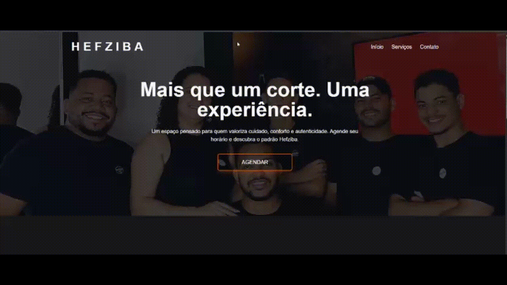
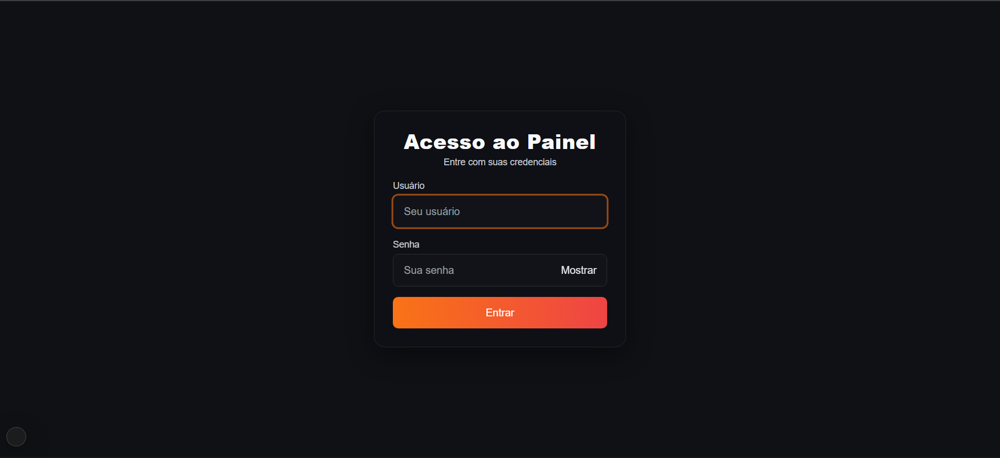
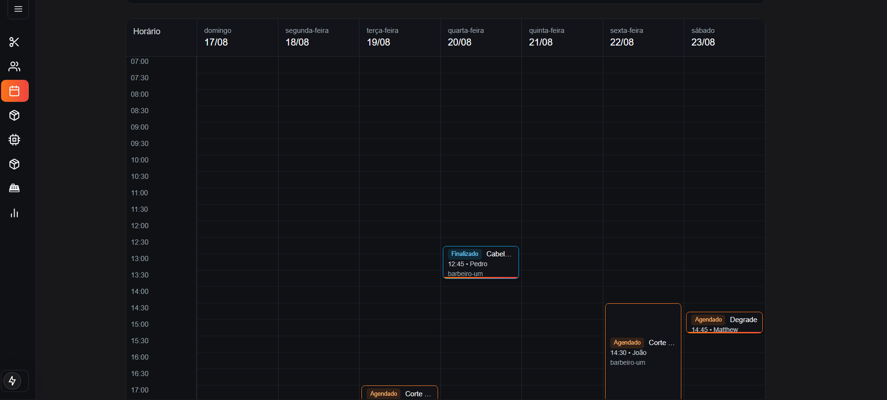
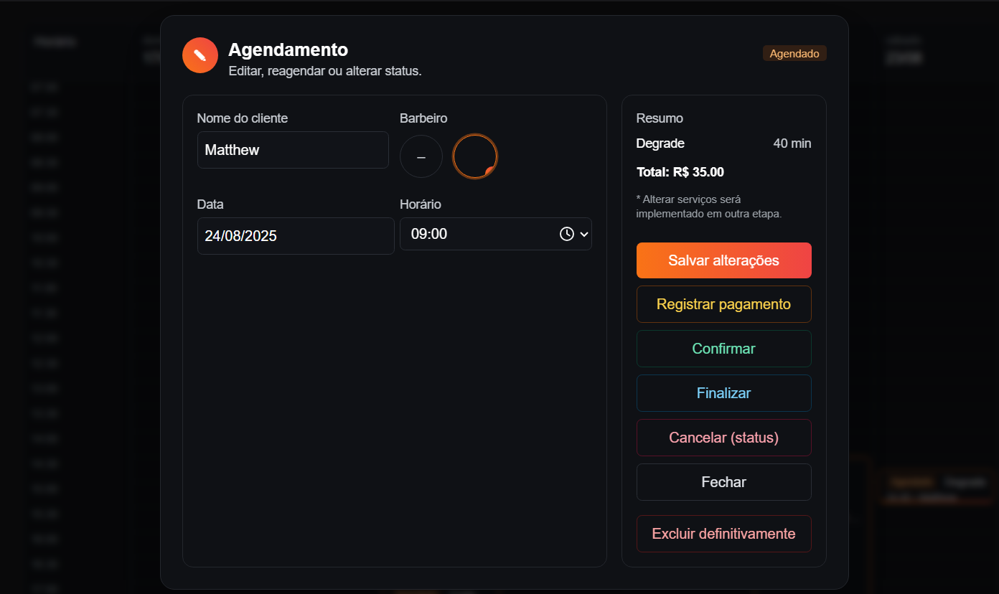
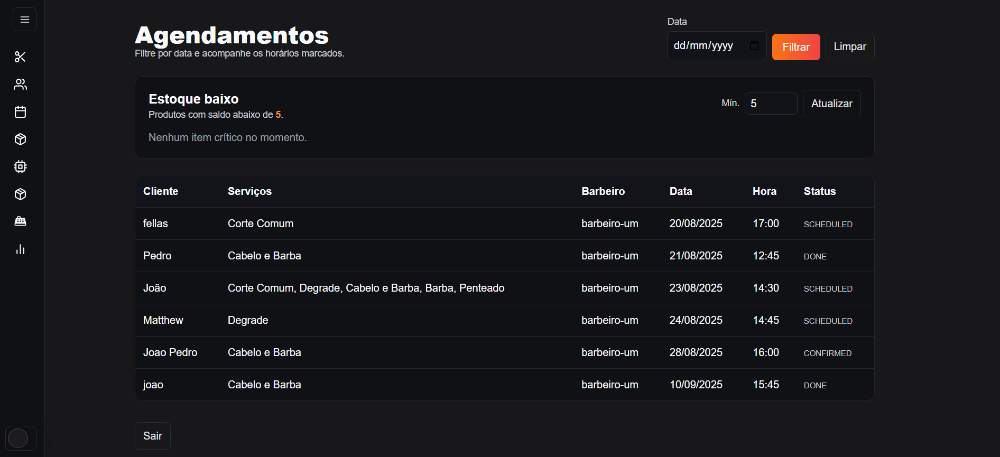
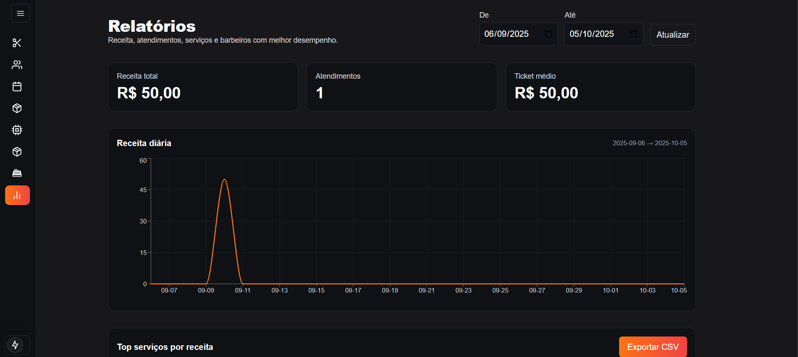

# 💈 Hefzibá Barbershop

Online system for **scheduling appointments** in a barbershop, developed with **Next.js**, **Tailwind CSS**, **TypeScript**, **MongoDB**, **Prisma** and **React.js**. With it, clients can schedule services and the barber can manage them quickly and easily.

---

## 📸 Demo coming soon

---

## ✂️ Features

- 📅 **Online appointment booking**
- 🧾 **Admin dashboard** for the barber to manage clients
- 🔍 **Date filter** to find appointments
- 📱 **Responsive design** for mobile, tablet, and desktop
- 🎨 Modern and intuitive interface
- 🔐 Secure and protected routes

---

## 🛠 Technologies Used

- [Next.js](https://nextjs.org/)
- [Tailwind CSS](https://tailwindcss.com/)
- [TypeScript](https://www.typescriptlang.org/)
- [Prisma](https://www.prisma.io/)
- [React Icons](https://react-icons.github.io/react-icons/)
- [Node.js](https://nodejs.org/)

# 📌 Future Improvements
- 🔔 Email or WhatsApp notifications
- 🖼 Image upload for barbershop portfolio
- 💳 Online payment integration
- 🗂 Appointment history

# 👨‍💻 Author
## João Pedro
[LinkedIn](https://www.linkedin.com/in/joão-pedro-almeida-504691335/) | 📧 joaopedroa2707@gmail.com